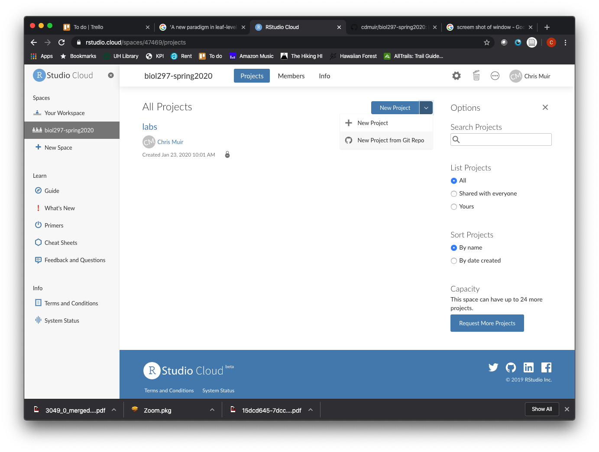

```{r setup, include=FALSE}
knitr::opts_chunk$set(echo = TRUE)
```

**Disclaimer: These labs rely heavily on those developed by Mike Whitlock for his BIOL 300 course at UBC <https://www.zoology.ubc.ca/~whitlock/bio300/>.** In some cases I have used his material *verbatim*, in other cases I have heavily modified them.

## Goals

* Learning how to start with *RStudio Cloud*
* Use the command line
* Use functions in *R*
* Learn how to increase the power *R* with packages
* Use vectors
* Use data frames

## Learning the Tools

### What is *R*?

*R* is a computer program that allows an extraordinary range of statistical calculations. It is a free program, mainly written by voluntary contributions from statisticians around the world. *R* is available on most operating systems, including Windows, Mac OS, and Linux.

*R* can make graphics and do statistical calculations. It is also a full-fledged computing language. In this manual, we will only scratch the surface of what *R* can do.

### What is *RStudio*?

*RStudio* is a separate program, also free, that provides a more elegant front end for *R*. *RStudio* allows you to easily organize separate windows for *R* commands, graphic, help, etc. in one place.

If your computer does not already have a version of *R* and *RStudio* installed, go to <http://www.zoology.ubc.ca/~whitlock/bio300/labs/downloadingR.html> for instructions about getting set up.

### What is *RStudio Cloud*?

From [here](https://docs.rstudio.com/other/rstudio-cloud/):

> *RStudio Cloud* is a hosted version of *RStudio* in the cloud that makes it easy for professionals, hobbyists, trainers, teachers and students to do, share, teach and learn data science using R.

> Create your analyses using *RStudio* directly from your browser - there is no software to install and nothing to configure on your computer.

#### Resources

> [*RStudio Cloud*](https://rstudio.cloud) provides many learning materials: [interactive tutorials](https://rstudio.cloud/learn/primers) covering the basics of data science, [cheatsheets](https://rstudio.cloud/learn/cheat-sheets) for working with popular *R* packages and a [guide to using *RStudio Cloud*](https://rstudio.cloud/learn/guide).

### Getting started

1. Set up an *RStudio Cloud* account using your user@hawaii.edu account. Go to [*RStudio Cloud* registration](https://login.rstudio.cloud/register) and click on "Sign up with Google" and follow prompts. Make sure to use your @hawaii.edu google account rather than a personal Google email account:


2. I will share the **biol297-spring2020** Workspace with you once everyone is registered.

3. Click on the **labs** Project




