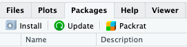

```{r setup, include=FALSE}
knitr::opts_chunk$set(echo = TRUE)
```

**Disclaimer: These labs rely heavily on those developed by Mike Whitlock for his BIOL 300 course at UBC <https://www.zoology.ubc.ca/~whitlock/bio300/>.** In some cases I have used his material *verbatim*, in other cases I have heavily modified them.

## Goals

* Learning how to start with *RStudio Cloud*
* Use the command line
* Use functions in *R*
* Learn how to increase the power *R* with packages
* Use vectors
* Use data frames

## Learning the Tools

### What is *R*?

*R* is a computer program that allows an extraordinary range of statistical calculations. It is a free program, mainly written by voluntary contributions from statisticians around the world. *R* is available on most operating systems, including Windows, Mac OS, and Linux.

*R* can make graphics and do statistical calculations. It is also a full-fledged computing language. In this manual, we will only scratch the surface of what *R* can do.

### What is *RStudio*?

*RStudio* is a separate program, also free, that provides a more elegant front end for *R*. *RStudio* allows you to easily organize separate windows for *R* commands, graphic, help, etc. in one place.

If your computer does not already have a version of *R* and *RStudio* installed, go to <http://www.zoology.ubc.ca/~whitlock/bio300/labs/downloadingR.html> for instructions about getting set up.

### What is *RStudio Cloud*?

From [here](https://docs.rstudio.com/other/rstudio-cloud/):

> *RStudio Cloud* is a hosted version of *RStudio* in the cloud that makes it easy for professionals, hobbyists, trainers, teachers and students to do, share, teach and learn data science using R.

> Create your analyses using *RStudio* directly from your browser - there is no software to install and nothing to configure on your computer.

#### Resources

> [*RStudio Cloud*](https://rstudio.cloud) provides many learning materials: [interactive tutorials](https://rstudio.cloud/learn/primers) covering the basics of data science, [cheatsheets](https://rstudio.cloud/learn/cheat-sheets) for working with popular *R* packages and a [guide to using *RStudio Cloud*](https://rstudio.cloud/learn/guide).

### Getting started

1. Set up an *RStudio Cloud* account using your user@hawaii.edu account. Go to [*RStudio Cloud* registration](https://login.rstudio.cloud/register) and click on "Sign up with Google" and follow prompts. Make sure to use your @hawaii.edu google account rather than a personal Google email account:


2. I will share the **biol297-spring2020** Workspace with you once everyone is registered.

3. Click on the **labs** Project


When you start *RStudio Cloud*, it will automatically start R as well. You run *R* inside *RStudio Cloud*. 

After you have started *RStudio Cloud*, you should see a new window with a menu bar at the top and three main sections. One of the sections is called the “Console” – this is where you type commands to give instructions to *R* and typically where you see *R*’s answers to you.

Another important corner of this window can show a variety of information. Most importantly to us, this is where graphics will appear, under the tab marked “Plots”.

### The command line

When you start *RStudio Cloud*, you’ll see a corner of the window called the “Console.” By the default the console window is in the bottom left of the *RStudio* screen.

You can type commands in this window where there is a prompt (which will look like a `>` sign at the bottom of the window). The Console has to be the selected window. (Clicking anywhere in the Console selects it.)

The `>` prompt is *R*’s way of inviting you to give it instructions. You communicate with R by typing commands after the `>` prompt.

Type “`2+2`” at the `>` prompt, and hit return. You’ll see that *R* can work like a calculator (among its many other powers). It will give you the answer, `4`, and it will label that answer with `[1]` to indicate that it is the first element in the answer. (This is sort of annoying when the answers are simple like this, but can be very valuable when the answers become more complex.)

Remember, you don’t type the `>` sign. The `>` is the prompt that *R* gives saying it is ready for input. We reproduce it here so you can see which is input (in blue) and which is output (in black or red).

```{r}
2+2
```

You can use a wide variety of math functions to make calculations here, e.g., `log()` calculates the log of a number:

```{r}
log(42)
```

(By default, this gives the natural log with base $e$.)

Parentheses are used both as a way to group elements of the calculation and also as a way to denote the arguments of functions. (The “arguments” of a function are the set of values given to it as input.) For example, `log(3)` is applying the function `log()` to the argument `3`.

Another mathematical function that often comes in handy is the square root function, `sqrt()`. For example, the square root of `4` is:

```{r}
sqrt(42)
```

To calculate a value with an exponent, used the `^` symbol. For example $4^3$ is written as:

```{r}
4 ^ 3
```

Note how *R* ignores white space when it's not in quotes (we'll come back to quotes later):

```{r}
4^3
4  ^  3
```

Of course, many math functions can be combined to give an almost infinite possibility of mathematical expressions. For example,

$$\frac{1}{\sqrt{2 \pi (3.1)^2}} e ^ {-\frac{(12 - 10.7) ^ 2}{2 \times 3.1}}$$

can be calculated with

```{r}
(1 / (sqrt(2 * pi * (3.1) ^ 2))) * exp(-(12 - 10.7) ^ 2 / (2 * 3.1))
```

### Saving your code

When you analyze your own data, we strongly recommend that you keep a record of all commands used, along with copious notes, so that weeks or years later you can retrace the steps of your earlier analysis.

In *RStudio Cloud*, you can create a text file (sometimes called a script), which contains *R* commands that can be reloaded and used at a later date. Under the menu at the top, choose “File”, then “New File”, and then “R Script”. This will create a new section in *RStudio Cloud* with the temporary name “Untitled1” (or similar). You can copy and paste any commands that you want from the Console, or type directly here. (When you copy and paste, it’s better to not include the `>` prompt in the script.)

If you want to keep this script for later, just hit "Save" under the "File" menu. In the future you can open this file in all the normal ways to have those commands available for use again.

It is best to type all your commands in the script window and run them from there, rather than typing directly into the console. This lets you save a record of your session so that you can more easily re-create what you have done later.

### Comments

In scripts, it can be very useful to save a bit of text which is not to be evaluated by *R*. You can leave a note to yourself (or a colleague) about what the next line is supposed to do, what its strengths and limitations are, or anything else you want to remember later. To leave a note, we use “comments”, which are a line of text that starts with the hash symbol `#`. Anything on a line after a # will be ignored by *R*.

```{r}
# This is a comment. Running this in R will 
# have no effect.
```

### Functions

Most of the work in *R* is done by functions. A function has a name and one or more arguments. For example, `log(4)` is a function that calculates the log in base $e$ for the value `4` given as input.

Sometimes functions have optional input arguments. For the function `log()`, for example, we can specify the optional input argument base to tell the function what base to use for the logarithm. If we don't specify the base variable, it has a default value of `base = e`. To get a log in base 10, for example, we would use:

```{r}
log(4, base = 10)
```

### Defining variables

In *R*, we can store information of various sorts by assigning them to variables. For example, if we want to create a variable called `x` and give it a value of `4`, we would write

```{r}
x <- 4
```

The middle bit of this -- a less than sign and a hyphen typed together to make something that looks a little like a left-facing arrow -- tells *R* to assign the value on the right to the variable on the left. After running the command above, whenever we use `x` in a command it would be replaced by its value `4`. For example, if we add `3` to `x`, we would expect to get `7`.

```{r}
x + 3
```

Variables in *R* can store more than just simple numbers. They can store lists of numbers, functions, graphics, etc., depending on what values get assigned to the variable.

We can always reassign a new value to a variable. If we now tell *R* that `x` is equal to 32

```{r}
x <- 32
```

then `x` takes its new value:

```{r}
x
```

### Names

Naming variables and functions in *R* is pretty flexible.

A name has to start with a letter, but that can be followed by letters or
numbers. There can’t be any spaces, though.

Names in R are case-sensitive, which means that `Weights` and `weights` are completely different things to *R*. This is a common and incredibly frustrating source of errors in *R*.

It’s a good idea to have your names be as descriptive as possible, so that you will know what you meant later on when looking at it. (However, if they get too long, it becomes painful and error prone to type them each time we use them, so this, as with all things, requires moderation.)

Sometimes clear naming means that it is best to have multiple words in the name, but we can't have spaces. Therefore a common approach is like we saw in the previous section, to chain the words with underscores (not hyphens!), as in `weights_before_hospital`. (Another solution to make separate words stand out in a variable name is to vary the case: `weightsBeforeHospital`. This is called "Camel Case" because the capital letters are like camel humps.)

### Vectors

One useful feature of *R* is the ability to sometimes apply functions to an entire collection of numbers. The technical term for a set of numbers is “vector”. For example, the following code will create a vector of five numbers:

```{r}
 c(78, 85, 64, 54, 102, 98.6)
```

`c()` is a function that creates a vector, containing the items given in its arguments. To help you remember, you could think of the function `c()` meaning to “**c**ombine” some elements into a vector.

Let’s add a little extra here to make the computer remember this vector. Let’s assign it to a variable, called `temperatureF` (because these numbers are actually a set of temperatures in degrees Fahrenheit):

```{r}
temperatureF <- c(78, 85, 64, 54, 102, 98.6)
```

The combination of the less than sign and the hyphen makes an arrow pointing from right to left—this tells *R* to assign the stuff on the right to the name on the left. In this case we are assigning a vector to the variable `temperatureF`.

Inputting this to *R* causes no obvious output, but *R* will now remember this vector of temperatures under the name `temperatureF`. We can view the contents of the vector `temperatureF` by simply typing its name:

```{r}
temperatureF
```

The power of vectors is that sometimes *R* can do the same calculation on all elements of a vector with one command. For example, to convert a temperature in Fahrenheit to Celsius, we would want to subtract `32` and multiply times `5/9`. We can do that for all the numbers in this vector at once:

```{r}
temperatureC <- (temperatureF - 32) * 5 / 9
temperatureC
```

To pull out one of the numbers in this vector, we add square brackets after the vector name, and inside those brackets put the index of the element we want. (The “index” is just a number giving the relative location in the vector of the item we want. The first item has index `1`, etc.) For example, the second element of the vector `temperatureC` is

```{r}
temperatureC[2]
```

One of the ways to slip up in *R* is to confuse the [square brackets] which pull out an element of a vector, with the (parentheses) , which is used to enclose the arguments of a function.

Vectors can also operate mathematically with other vectors. For example, imagine you have a vector of the body weights of patients before entering hospital (`weight_before_hospital`) and another vector with the same patient’s weights after leaving hospital (`weight_after_hospital`). You can calculate the change in weight for all these patients in one command, using vector subtraction:

```{r}
weight_before_hospital <- c(100, 102)
weight_after_hospital <- c(98, 99)

weight_change_during_hospital <- weight_before_hospital - weight_after_hospital
```

The result will be a vector that has each patient’s change in weight.

### Basic calculation examples

In this course, we’ll learn how to use a few dozen functions, but let’s start with a couple of basic ones.

The function `mean()` does just what it sounds like: it calculates the sample mean (that is, the average) of the vector given to it as input. For example, the mean of the vector of the temperatures in degrees Celsius from above is 26.81481:

```{r}
mean(temperatureC)
```

Another simple (and simply named) function calculates the sum of all numbers in a vector: `sum()`.

```{r}
sum(temperatureC)
```

To count the number of elements in a vector, use `length()`.

```{r}
length(temperatureC)
```

This shows that there are 6 temperature values in the vector that make up the vector `temperatureC`.

### Extending *R*'s capabilities

*R* has a lot of power in its basic form, but one of the most important parts about *R* is that it is expandable by the work of other people. These expansions are usually released in “packages”.

Each package needs to be installed on your computer only once, but to be used it has to be loaded into *R* during each session.

To install a package in *RStudio Cloud*, click on the packages tab from the sub-window with tables for Files, Plots, Packages, Help, and Viewer. Immediately below that will be a button labeled “Install” -- click that and a window will open.



In the second row (labeled “Packages”), type **ggplot2** (without the quotation marks). Make sure the box for “Install dependencies” near the bottom is clicked, and then click the “Install” button at bottom right. This will install the graphics package **ggplot2**.


This only needs to be done once on a given computer or *RStudio Cloud* Workspace, and that package is permanently available.

There is another package that we will use in this course (and briefly today) called **dplyr**. While you are installing packages, go ahead and install **dplyr** as well.

### Loading a package

Once a package is installed, it needs to be loaded into *R* during a session if you want to use it. You do this with a function called `library()`.

For this week’s labs, we will use the package **dplyr**, which allows for easy modification of data frames. Before using the functions in this package, we need to load it. We do this with the `library()` function. In the console, enter this

```{r}
library(dplyr)
```

If the **dplyr** package is installed on your computer, the computer will just give a new prompt and be ready to go. If the package is not installed it will give you an error message in red asking you to get the package installed. (See the section above.)

### Set the working directory

The files on your workspace and computers are organized hierarchically into folders, or “directories.” It is convenient in *RStudio Cloud* to tell *R* which directory to look for files at the beginning of a session, to minimize typing later.

For these labs, the best way to set your working directory is to start *R* and *Rstudio Cloud* by clicking on the "labs" project in the biol297-spring2020 Workspace. This will automatically load the needed packages and set the working directory to this folder.

You can also set the working directory for *RStudio Cloud* from *RStudio Cloud*’s menu. From the “Session” tab in the menu bar, choose “Set Working Directory”, and then “Choose Directory...” This will open a dialog box that will let you find and select the directory you want. For these labs, we will assume that you are using as your working directory the “labs” folder that is distributed with this lab manual.

### Reading a file

In this course, we have saved the data in a “comma-separated variable” format. All files in this format ought to have “.csv” as the end of their file name. A CSV file is a plain text file, easily read by a wide variety of programs. Each row in the file (besides the first row) is the data for a given individual, and for each individual each variable is listed in the same order, separated by commas. It’s important to note that you can’t have commas anywhere else in the file, besides the separators.

The first row of a CSV file should be a “header” row, which gives the names of each variable, again separated by commas.

For examples in this tutorial, let’s use a data set about the passengers of the *RMS Titanic*. One of the data sets in the folder of data attached to this lab is called “titanic.csv”. This is a data set of 1313 passengers from the voyage of this ship, which contains information about some personal info about each passenger as well as whether they survived the accident or not.

To import a CSV file into *R*, use the `read.csv()` function as in the following command. (This assumes that you have set the working directory to the labs folder, as we described above.)

```{r, echo=FALSE, eval=TRUE}
titanicData <- read.csv("../Data/titanic.csv")
```

```{r, echo = TRUE, eval = FALSE}
titanicData <- read.csv("Data/titanic.csv")
```

This looks for the file called `titanic.csv` in the folder called `Data`. Here we have given the name `titanicData` to the object in *R* that contains all this passenger data. Of course, if you wanted to load a different data set, you would be better off giving it a more apt name than “`titanicData`”.

To see if the data loads appropriately, you might want to run the command

```{r}
summary(titanicData)
```

which will list all the variables and some summary statistics for each variable.

### Intro to data frames

A data frame is a way that *R* can store a data set on a number of individuals. A data frame is a collection of columns; each column contains the values of a single variable for all individuals. The values of each individual occur in the same order in all the columns, so the first value for one variable represents the same individual as the first value in the lists of all other variables.

The function `read.csv()` loads the data it reads into a data frame.

The data frame is usually given a name, which is used to tell *R*’s functions which data set to use. For example, in the previous section we read in a data set to a data frame that we called `titanicData`. This data frame now contains information about each of the passengers on the *Titanic.* This data frame has seven variables, so it has seven columns (`passenger_class`, `name`, `age`, `embarked`, `home_destination`, `sex`, and `survive`).

Very importantly, we can grab one of the columns from a data frame by itself. We write the name of the data frame, followed by a `$`, and then the name of the variable.

For example, to show a list of the age of all the passengers on the *Titanic*, use

```{r}
titanicData$age
```

This will show a vector that has all the values for this variable `age`, one for each individual in the data set.

### Adding a new column

Sometimes we would like to add a new column to a data frame. The easiest way to do this is to simply assign a new vector to a new column name, using the `$`.

For example, to add the log of age as a column in the `titanicData` data frame, we can write

```{r}
titanicData$log_age <- log(titanicData$age)
```

You can run the command `head(titanicData)` to see that `log_age` is now a column in `titanicData`.

### Choosing subsets of data

Sometimes we want to do an analysis only on some of the data that fit certain criteria. For example, we might want to analyze the data from the *Titanic* using only the information from females.

The easiest way to do this is to use the `filter()` function from the package dplyr. Make sure you have sourced the `dplyr` package as described above, and then load it into *R* using `library()`:

```{r}
library(dplyr)
```

In the titanic data set there is a variable named `sex`, and an individual is female if that variable has value “`female`”. We can create a new data frame that includes only the data from females with the following command:

```{r}
filter(titanicData, sex == "female")
```

This new data fame will include all the same columns as the original `titanicData`, but it will only include the rows for which the `sex` was “`female`”.

Note that the syntax here requires a double `==` sign. In *R* (and many other computer languages), the double equal sign creates a statement that can be evaluated as `TRUE` or `FALSE`, while a single equal sign may change the value of the first variable to the value on the right-hand side of the equal sign. Here we are asking, for each individual, whether `sex` is “`female`”, not assigning the value ”`female`” to the variable sex. So we use a double equal sign `==`.