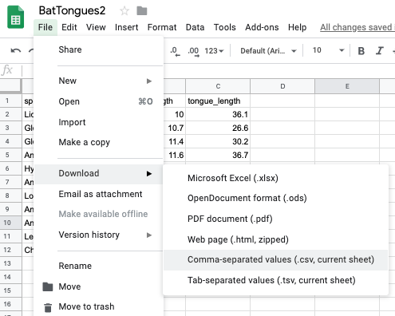
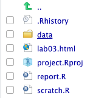
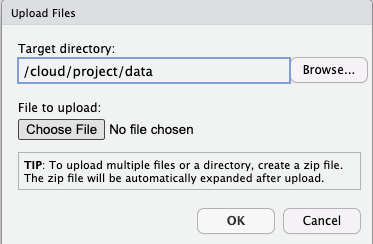
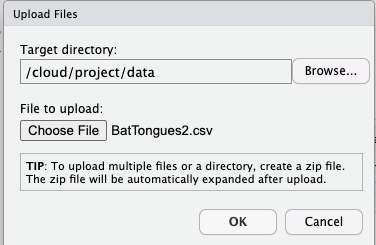
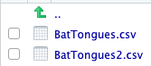
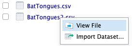

```{r setup, include=FALSE}
knitr::opts_chunk$set(echo = TRUE)
```

**Disclaimer: These labs rely heavily on those developed by Mike Whitlock for his BIOL 300 course at UBC <https://www.zoology.ubc.ca/~whitlock/bio300/>.** In some cases I have used his material *verbatim*, in other cases I have heavily modified them.

## Goals

* Understand the sampling distribution of an estimate
* Investigate sampling error and sampling bias

## Learning the Tools

### Structure of a good data file

Data files appear in many formats, and different formats are sometimes preferable for different tasks. But there is one way to structure data — called “long” format — that is extremely useful for most things that you will want to do in statistics and *R*.

Long format is actually very simple. Every row in the data set is a unique individual. Every column is a variable being measured on those individuals.

For example, last week in Question 4 we looked at some data about the tongue and palate lengths of several species of bats. There were three variables in that data set, the species name, tongue length, and palate length. Here each “individual” is a species. Here is that data in long format—each row is an individual. There are three columns, one for each variable:

```{r, echo = FALSE, eval = TRUE}
bat_tongues <- read.csv("../Data/BatTongues.csv")
knitr::kable(bat_tongues)
# knitr::knit(bat_tongue)
```

### Creating a data file

When you have new data that you want to get into the computer in a format that *R* can read, it is often easiest to do this outside of *R*. A spreadsheet program like Excel (or a freely available program like Google Sheets) is a straightforward way to create a .csv file that *R* can read. For the lab today, we'll use Google Sheets.

1. Log into Google Drive using your userid@hawaii.edu credentials.

2. Create a new Google Sheet


3. Name the new sheet "BatTongues2"


4. Enter data

In the first row of your new spreadsheet, write your variable names, one for each column. (Be sure to give them good names that will work in *R*. Mainly, don't have any spaces in a variable name and make sure that it doesn't start with a number or contain punctuation marks. See Week 1 for more about naming variables.)

On the rows immediately below that first row, enter the data for each individual, in the correct column. Here’s what the spreadsheet would look like for the bat data after they are entered:


5. Download as a .csv file. Go to "File > Download > Comma-spearate values (.csv, current sheet)"


Save to the Desktop (or elsewhere that is convenient) as "BatTongues2.csv"


Saving a spreadsheet in a format that *R* can read is very straightforward. In these tutorials, we are using .csv files (which stands for **c**omma **s**eparated **v**alues).

6. Upload file to *RStudio Cloud*

In your Week 3 project, click on the "Data" directory under the Files tab:



Then click the Upload option:


You should see the following dialog box:


Click "Choose File" and navigate to where you saved "BatTongues2.csv" and select it. 



Click OK. Then you should see "BatTongues2.csv" in your Data directory.


Look at "BatTongues2.csv" in the *RStudio Cloud* viewer by clicking the file name and selecting "View File"



It should something like this:


## Activities and Questions

### 1. Review: Import "BatTongues2.csv" using the `read.csv()`, name the data.frame `bat_tongues`, and make a scatterplot using the **ggplot2** package. It should look the same as last week unless you made a typo.

### 2. Calculate the sample variance and standard deviation.

The variance and standard deviation are common descriptions of the variability in a population. If we're plotting the data in a histogram, these are associated with the "width" of histogram. By convention the *population* variance and standard deviations are often denoted $\sigma ^ 2$ and $\sigma$, respectively ($\sigma$, pronounced sig-ma, is a lowercase Greek letter). The *sample* variance and standard deviations are often denoted $s^2$ and $s$, respectively. In both cases, the standard deviation is simply the square root of the variance.

 parameter           | population   | sample
---------------------|--------------|---------
variance             | $\sigma ^ 2$ | $s ^ 2$ 
standard deviation   | $\sigma$     | $s$

The equations for the sample variance and standard deviation are:

$$ s ^ 2 = \frac{\Sigma^{n}_{i=1} (Y_i - \bar{Y}) ^ 2}{n - 1} $$
$$ s = \sqrt{\frac{\Sigma^{n}_{i=1} (Y_i - \bar{Y}) ^ 2}{n - 1}} $$

  a.  Calculate the sample variance of the `palate_length` variable. Note that if you named the column something other than `palate_length`, you will have to use your name. Here's a couple hints to get started:

```{r, echo = TRUE, eval = FALSE}

# Create a vector and call it Y
Y <- bat_tongues$palate_length

# Calculate the mean of Y
Y_bar <- mean(Y)

# Calculate the sample size, n
n <- length(Y)

# Calculate the squared deviations (Y_i - Y_bar) ^ 2
squared_devs <- (Y - Y_bar) ^ 2

```

Once you're done, you can check your answer using the `var()` function in *R*

```{r, echo = FALSE, eval = TRUE}

bat_tongues <- read.csv("../Data/BatTongues2.csv")

```

```{r, echo = TRUE, eval = TRUE}

var(bat_tongues$palate_length)

```

  b. Now calculate the standard deviation and check your result using the `sd()` function:

```{r, echo = TRUE, eval = TRUE}

sd(bat_tongues$palate_length)

```

### 3. Learning when to use mean versus median

For this excercise, we'll use a dataset on leaf area from Wright *et al.* 2017^[The original paper can be found [here](https://doi.org/10.1126/science.aal4760)]. 

  a. Import the file "wright_etal_2017.csv" from the Data directory using the `read.csv()` function. Call the data.frame `leafsize`.
  
  b. Make a histogram of leaf size (units of cm$^2$) using **ggplot2**. The variable name is `leafsize_cm2`. It should look something like this:

```{r, echo = FALSE, eval = TRUE, message = FALSE, warning = FALSE}

leafsize <- read.csv("../Data/wright_etal_2017.csv")

library(ggplot2)

ggplot(leafsize, aes(x = leafsize_cm2)) +
  geom_histogram()

```

  c. Describe the distribution of leaf size. Do you expect the mean or median to be larger? Check your answer using the `mean()` and `median()` functions. Make sure to use the `na.rm = TRUE` argument to ignore missing data. Which value would you use to describe the location (aka central tendency) of leaf size in this dataset?
  
  d. Now let's look at the power of log-transformation. First, use the `+ scale_x_log10()` function in **ggplot2** to plot leaf size on a log$_{10}$-transformed scale. Modify your previous histogram using this function. The output should look something like this:
  
```{r, echo = FALSE, eval = TRUE, message = FALSE, warning = FALSE}

ggplot(leafsize, aes(x = leafsize_cm2)) +
  geom_histogram() +
  scale_x_log10()

```

Now describe the shape of this distribution. Would you expect the mean or median to be higher? Check your guesses by first creating a new column called `log10_leafsize_cm2`. Hint: you'll need to use the `$` operator and the `log(..., base = 10)` function we used previously. Then use `mean()` and `median()` on the new column.

  e. Now, would you still use the same function (`mean()` or `median()`) you selected in part c. to describe the location of the *log-transformed* leaf size? Explain your answer.
  
### 4. Make a random sample

Let's assume that the dataset represents the entire population of leaf sizes in the world (it doesn't, but let's just assume). Now we'll look at the property of random samples from this population. 

  a. To make our lives simpler, let's first filter out the missing values using the `filter()` function in **dplyr**.

```{r, echo = TRUE, eval = TRUE, message = FALSE, warning = FALSE}

leafsize <- read.csv("../Data/wright_etal_2017.csv")

library(dplyr)

leafsize <- filter(leafsize, !is.na(leafsize_cm2))

```

Note how we simply re-assigned the name `leafsize` after filtering it. The function `!is.na()` keeps all values that are NOT `NA` (i.e. missing). In *R*, `!` means NOT.

  b. What is the sample size now? You can use the `length()` function or `nrow()` function to figure this out. Once you do, assign that to `nleaves`. For example, if there were a 100 individuals in the sample, I would use `nleaves <- 100`.

```{r, echo = FALSE, eval = TRUE, message = FALSE, warning = FALSE}

nleaves <- nrow(leafsize)

```

  c. To take a random sample, all members of the population must have the same chance of being chosen for our sample. In *R*, the function `sample.int()` randomly chooses integers from a given range. For example, to randomly sample 5 individuals from 25 possibilities, we can use:
  
```{r}
sample.int(n = 25, size = 5)
```

This tells *R* to give us a set of 5 numbers randomly chosen from the integers 1 to 25. (When you run this line you will almost certainly get a different output. It is randomly choosing numbers, so we expect different answers each time.)

Here's a fun trick - if you want to get the same random sample every time, use the `set.seed()` function. Run the code below and you should get the same answer as me.

```{r}
set.seed(20200206)
sample.int(n = 25, size = 5)
```

Now randomly sample 5 leaf sizes and assign the output to a vector called `i`:

```{r, echo = TRUE, eval = TRUE}
i <- sample.int(n = nleaves, size = 5)
```

  d. The brackets `[ ]` in *R* let you extract portions of a vector. To sample the values from the random sample you took and assign the output as `leafsize_sample`, run the following code:
  
```{r, echo = TRUE, eval = FALSE}
leafsize_sample <- leafsize$leafsize_cm2[i]
```

  e. Use *R* to calculate the mean of the leaf sizes for these 5 leaves in your random sample. The result is an estimate of the mean leaf size in your population.
  
  f. Make another random sample of 5 leaves, and calculate the mean of this sample. Did you get a different number from the mean of the first sample? Why do you think the second sample mean is different from the first?